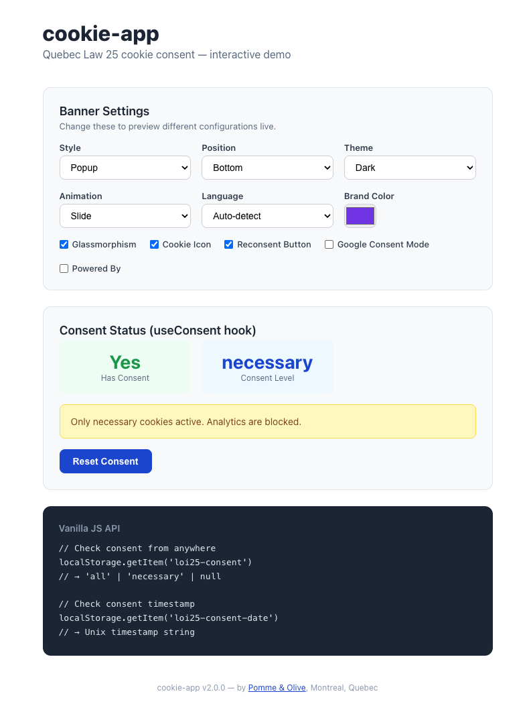

# cookie-app

Quebec Law 25 (Bill 64) cookie consent for **React & Next.js 15**.

Script blocking, Google Consent Mode v2, 3 banner styles, bilingual (FR/EN), zero dependencies.



---

## Features

- **Zero config** — works out of the box with sensible defaults
- **Script Vault** — blocks tracking scripts until consent is granted
- **Google Consent Mode v2** — full compliance with all 7 consent types, `wait_for_update`, `ads_data_redaction`, `url_passthrough`, and region-scoped defaults
- **Synchronous head script** — `getConsentModeScript()` helper for correct tag ordering
- **3 banner styles** — full-width bar, centered popup, corner widget
- **Glassmorphism** — modern frosted glass effect
- **Bilingual** — French (default) and English with auto-detection
- **Custom text** — override every string in both languages
- **Brand color** — match your website's design
- **Consent expiry** — auto re-ask after configurable days
- **Re-consent button** — floating cookie button to change consent
- **Smooth animations** — slide or fade transitions
- **Custom CSS** — full styling control
- **Accessible** — keyboard navigation (Escape = reject), ARIA labels, focus management
- **SSR-safe** — works with Next.js 15 App Router and Server Components
- **TypeScript** — full type definitions included
- **Tiny** — zero external dependencies, under 10KB

---

## Installation

```bash
npm install cookie-app
```

```bash
yarn add cookie-app
```

```bash
pnpm add cookie-app
```

---

## Quick Start

### Next.js 15 (App Router)

```tsx
// app/layout.tsx
import { CookieConsent } from "cookie-app";

export default function RootLayout({
  children,
}: {
  children: React.ReactNode;
}) {
  return (
    <html lang='fr'>
      <body>
        {children}
        <CookieConsent />
      </body>
    </html>
  );
}
```

That's it! The banner appears automatically for new visitors with French defaults.

---

## Google Consent Mode v2 (Compliant Setup)

For full compliance with the [official Google documentation](https://developers.google.com/tag-platform/security/guides/consent), you need **two parts**:

1. A **synchronous inline script** in `<head>` that sets consent defaults **before** Google tags load
2. The **`<CookieConsent>`** component that sends `consent('update', ...)` when the user interacts

### Recommended Setup

```tsx
// app/layout.tsx (Next.js 15 App Router)
import { CookieConsent, getConsentModeScript } from "cookie-app";

export default function RootLayout({
  children,
}: {
  children: React.ReactNode;
}) {
  return (
    <html lang='fr'>
      <head>
        {/* 1. Consent defaults — MUST come before the Google tag */}
        <script dangerouslySetInnerHTML={{ __html: getConsentModeScript() }} />

        {/* 2. Google tag (gtag.js) — loads AFTER consent defaults are set */}
        <script
          async
          src='https://www.googletagmanager.com/gtag/js?id=G-XXXXX'
        />
        <script
          dangerouslySetInnerHTML={{
            __html: `
          window.dataLayer = window.dataLayer || [];
          function gtag(){dataLayer.push(arguments);}
          gtag('js', new Date());
          gtag('config', 'G-XXXXX');
        `,
          }}
        />
      </head>
      <body>
        {children}

        {/* 3. Consent banner — handles consent('update') on user choice */}
        <CookieConsent
          consentMode
          adsDataRedaction
          urlPassthrough
          lang='auto'
          style='popup'
          theme='dark'
          privacyUrl='/privacy'
        />
      </body>
    </html>
  );
}
```

### What this does

| Step                      | Timing                  | What happens                                                                                                                                                   |
| ------------------------- | ----------------------- | -------------------------------------------------------------------------------------------------------------------------------------------------------------- |
| `getConsentModeScript()`  | Synchronous in `<head>` | Sets all consent types to `denied` with `wait_for_update: 500ms`. For returning users who previously accepted, immediately calls `consent('update', granted)`. |
| Google tag loads          | After consent defaults  | Tags see the default consent state and behave accordingly.                                                                                                     |
| `<CookieConsent>` mounts  | After hydration         | Also sets defaults via `useEffect` as a fallback, and applies `ads_data_redaction` / `url_passthrough`.                                                        |
| User clicks Accept/Reject | On interaction          | Calls `consent('update', ...)` with `granted` or `denied` for all 4 tracking types.                                                                            |

### `getConsentModeScript()` Options

```tsx
getConsentModeScript({
  // Override defaults (all default to 'denied' except functional types)
  ad_storage: "denied",
  ad_user_data: "denied",
  ad_personalization: "denied",
  analytics_storage: "denied",
  functionality_storage: "granted", // default: 'granted'
  personalization_storage: "granted", // default: 'granted'
  security_storage: "granted", // default: 'granted'

  // How long Google tags wait for consent update (ms)
  wait_for_update: 500, // default: 500

  // Scope defaults to specific regions (ISO 3166-2)
  region: ["CA-QC"],

  // Redact ad click identifiers when ad_storage is denied
  ads_data_redaction: true,

  // Pass GCLID/DCLID through URL params when cookies denied
  url_passthrough: true,

  // Must match expiryDays on <CookieConsent>
  expiry_days: 365,
});
```

### Consent Types Managed

| Consent Type              | Default   | Description                                      |
| ------------------------- | --------- | ------------------------------------------------ |
| `ad_storage`              | `denied`  | Advertising cookie storage                       |
| `ad_user_data`            | `denied`  | User data for advertising                        |
| `ad_personalization`      | `denied`  | Personalized advertising                         |
| `analytics_storage`       | `denied`  | Analytics cookie storage                         |
| `functionality_storage`   | `granted` | Functionality (e.g. language settings)           |
| `personalization_storage` | `granted` | Personalization (e.g. video recommendations)     |
| `security_storage`        | `granted` | Security (e.g. authentication, fraud prevention) |

---

## Full Example

```tsx
import { CookieConsent } from "cookie-app";

<CookieConsent
  lang='auto'
  position='bottom'
  theme='dark'
  style='popup'
  glassmorphism
  brandColor='#7c3aed'
  privacyUrl='/politique-de-confidentialite'
  expiryDays={365}
  showReconsent
  showIcon
  animation='slide'
  consentMode
  adsDataRedaction
  urlPassthrough
  consentModeRegion={["CA-QC"]}
  scripts={`
    <!-- Google Analytics -->
    <script async src="https://www.googletagmanager.com/gtag/js?id=G-XXXXXX"></script>
    <script>
      window.dataLayer = window.dataLayer || [];
      function gtag(){dataLayer.push(arguments);}
      gtag('js', new Date());
      gtag('config', 'G-XXXXXX');
    </script>
  `}
  textsFr={{
    title: "Respect de votre vie privée",
    message: "Nous utilisons des cookies pour améliorer votre expérience.",
    accept: "Tout accepter",
    reject: "Refuser",
  }}
  textsEn={{
    title: "Your Privacy Matters",
    message: "We use cookies to improve your experience.",
    accept: "Accept All",
    reject: "Reject",
  }}
  onConsent={(level) => {
    console.log("User chose:", level); // 'all' or 'necessary'
  }}
/>;
```

---

## Props

| Prop                | Type                            | Default                           | Description                                                               |
| ------------------- | ------------------------------- | --------------------------------- | ------------------------------------------------------------------------- |
| `lang`              | `'fr' \| 'en' \| 'auto'`        | `'fr'`                            | Banner language. `'auto'` detects from `navigator.language`.              |
| `position`          | `'top' \| 'bottom'`             | `'bottom'`                        | Banner position (bar & corner styles).                                    |
| `theme`             | `'light' \| 'dark'`             | `'light'`                         | Color theme.                                                              |
| `style`             | `'bar' \| 'popup' \| 'corner'`  | `'bar'`                           | Banner display style.                                                     |
| `glassmorphism`     | `boolean`                       | `false`                           | Frosted glass effect.                                                     |
| `privacyUrl`        | `string`                        | `'/politique-de-confidentialite'` | Privacy policy link URL.                                                  |
| `poweredBy`         | `boolean`                       | `false`                           | Show "Powered by Pomme&Olive" link.                                       |
| `brandColor`        | `string`                        | `'#1d4ed8'`                       | Accept button & reconsent button color.                                   |
| `expiryDays`        | `number`                        | `365`                             | Days before consent expires.                                              |
| `showReconsent`     | `boolean`                       | `true`                            | Show floating reconsent button.                                           |
| `animation`         | `'slide' \| 'fade'`             | `'slide'`                         | Animation type.                                                           |
| `showIcon`          | `boolean`                       | `true`                            | Show cookie emoji in banner & button.                                     |
| `customCss`         | `string`                        | `''`                              | Custom CSS targeting `#loi25-banner`.                                     |
| `textsFr`           | `ConsentTexts`                  | —                                 | French text overrides.                                                    |
| `textsEn`           | `ConsentTexts`                  | —                                 | English text overrides.                                                   |
| `onConsent`         | `(level: ConsentLevel) => void` | —                                 | Callback when user consents.                                              |
| `consentMode`       | `boolean`                       | `false`                           | Enable Google Consent Mode v2.                                            |
| `adsDataRedaction`  | `boolean`                       | `false`                           | Redact ad click identifiers when `ad_storage` is denied.                  |
| `urlPassthrough`    | `boolean`                       | `false`                           | Pass GCLID/DCLID through URL params when cookies denied.                  |
| `consentModeRegion` | `string[]`                      | —                                 | ISO 3166-2 region codes to scope consent defaults (e.g. `['CA-QC']`).     |
| `waitForUpdate`     | `number`                        | `500`                             | Milliseconds Google tags wait for consent update before firing.           |
| `scripts`           | `string`                        | `''`                              | HTML of tracking scripts to block until consent.                          |
| `reloadOnConsent`   | `boolean`                       | `false`                           | Reload page after accepting (for scripts that need page-start execution). |

---

## `useConsent` Hook

Read and manage consent state from any component. SSR-safe.

```tsx
"use client";

import { useConsent } from "cookie-app";

export function AnalyticsLoader() {
  const { consent, hasConsent, resetConsent, setConsent } = useConsent();

  if (hasConsent && consent === "all") {
    return <p>Analytics are enabled.</p>;
  }

  return (
    <div>
      <p>No analytics consent.</p>
      <button onClick={resetConsent}>Change cookie preferences</button>
    </div>
  );
}
```

### Return Values

| Property       | Type                            | Description                                 |
| -------------- | ------------------------------- | ------------------------------------------- |
| `consent`      | `'all' \| 'necessary' \| null`  | Current consent level.                      |
| `hasConsent`   | `boolean`                       | Whether valid (non-expired) consent exists. |
| `resetConsent` | `() => void`                    | Clear consent and trigger banner.           |
| `setConsent`   | `(level: ConsentLevel) => void` | Set consent programmatically.               |

---

## Script Vault

The killer feature. Paste your tracking scripts into the `scripts` prop and they are **automatically blocked** until the user clicks "Accept All".

```tsx
<CookieConsent
  scripts={`
    <!-- Meta Pixel -->
    <script>
      !function(f,b,e,v,n,t,s){...}(window,document,'script',
      'https://connect.facebook.net/en_US/fbevents.js');
      fbq('init', '123456789');
      fbq('track', 'PageView');
    </script>

    <!-- Hotjar -->
    <script>
      (function(h,o,t,j,a,r){...})(window,document,'https://static.hotjar.com/c/hotjar-','.js?sv=');
    </script>
  `}
/>
```

Scripts are dynamically injected into `<head>` after consent. For scripts that must run at page load (e.g., GTM), set `reloadOnConsent` to trigger a page reload.

---

## Exported Constants

```tsx
import {
  STORAGE_KEY, // 'loi25-consent'
  STORAGE_DATE_KEY, // 'loi25-consent-date'
  CONSENT_CHANGE_EVENT, // 'loi25-consent-change'
  DEFAULT_BRAND_COLOR, // '#1d4ed8'
  DEFAULT_EXPIRY_DAYS, // 365
  DEFAULT_WAIT_FOR_UPDATE, // 500
  DEFAULT_TEXTS, // { fr: {...}, en: {...} }
} from "cookie-app";
```

### Vanilla JS API

You can also check consent outside of React:

```js
localStorage.getItem("loi25-consent"); // 'all' | 'necessary' | null
```

---

## TypeScript

All types are exported:

```tsx
import type {
  ConsentLevel,
  Language,
  BannerStyle,
  BannerPosition,
  BannerTheme,
  Animation,
  ConsentTexts,
  CookieConsentProps,
  ConsentState,
  ConsentModeDefaults,
} from "cookie-app";
```

---

## Banner Styles

### Bar (default)

Full-width bar fixed to top or bottom of the viewport.

### Popup

Centered modal with a semi-transparent overlay backdrop.

### Corner

Compact widget anchored to the bottom-right (or top-right) corner.

---

## Migration from WordPress Plugin

If you're migrating from the WordPress plugin:

| React Prop                            |
| ------------------------------------- |
| `lang`                                |
| `position`                            |
| `theme`                               |
| `style`                               |
| `glassmorphism`                       |
| `privacyUrl`                          |
| `poweredBy`                           |
| `brandColor`                          |
| `consentMode`                         |
| `expiryDays`                          |
| `showReconsent`                       |
| `animation`                           |
| `showIcon`                            |
| `customCss`                           |
| `scripts`                             |
| `textsFr.title` / `textsEn.title`     |
| `textsFr.message` / `textsEn.message` |
| `textsFr.accept` / `textsEn.accept`   |
| `textsFr.reject` / `textsEn.reject`   |

**What's different:**

- No admin settings page (configuration is via props)
- No dashboard stats widget (use `onConsent` callback to log to your own backend)
- No database table (use `onConsent` for server-side logging)
- No cache flushing (not needed in Next.js)
- localStorage keys are identical -- consent carries over from the WordPress version

---

## License

MIT -- [Pomme&Olive](https://pomme-olive.com), Montreal, Quebec.
